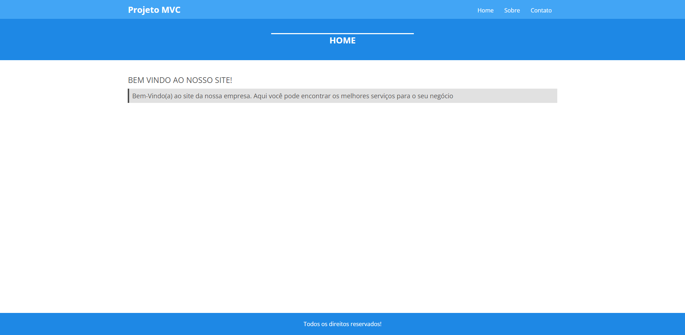
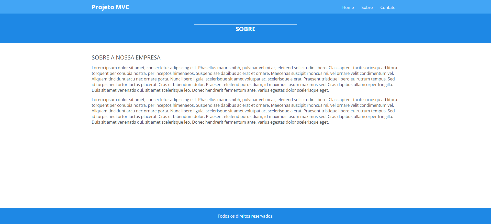
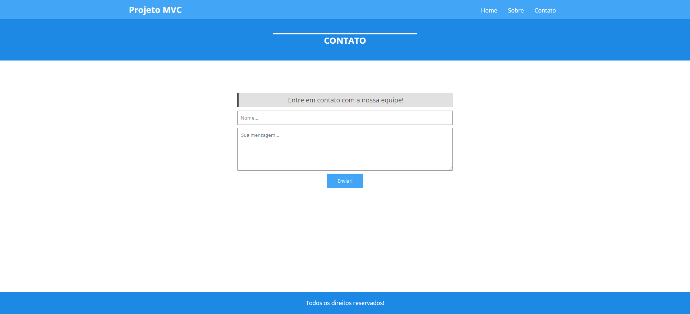
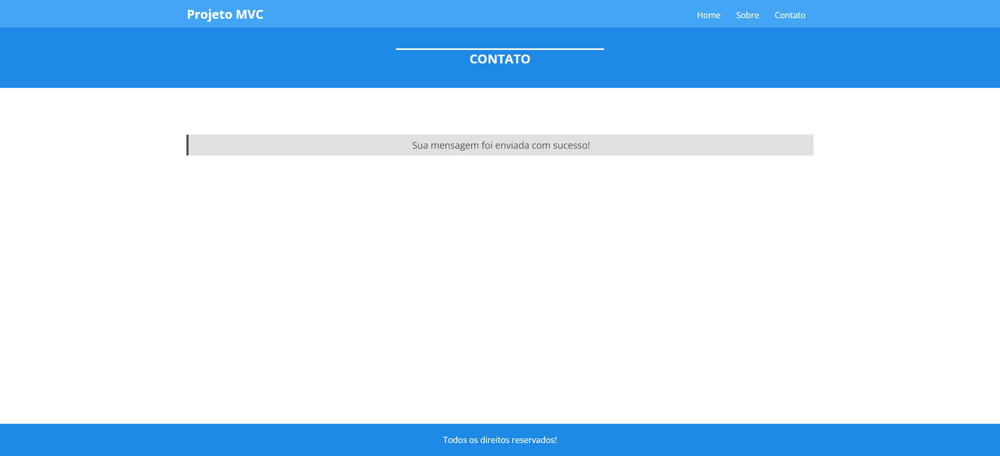

<h1 align="center">
  MVC Basico PHP
</h1>

  <a href="#open_book-sobre">Sobre</a>
  &nbsp;&nbsp;&nbsp;|&nbsp;&nbsp;&nbsp;
  <a href="#hammer-tecnologias">Tecnologias</a>
  &nbsp;&nbsp;&nbsp;|&nbsp;&nbsp;&nbsp;
  <a href="#rocket-resultado">Resultado</a>

## :open_book: Sobre
Este repositório contêm uma estrutura básica em mvc, para desenvolver projetos web.

## :hammer: Tecnologias
Este projeto foi feito com as seguintes tecnologias:
- HTML5
- CSS3
- JavaScript
- PHP 7

## :rocket: Resultado

  
  
  
  

